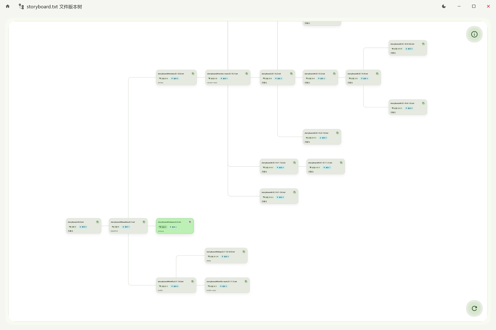

# Vertree

File previews use the bundled Office Viewer frontend (embedded on Windows/macOS, local browser on Linux). Before the first Flutter build, install Node.js 24 and Python 3 and run `python tools/build_office_preview.py`. Windows additionally needs NuGet CLI for building and WebView2 Runtime for viewing. See [integration notes](docs/office-preview.md).

Vertree is a desktop version manager for single files. It is meant for evolving design files, documents, scripts, and config files that do not fit cleanly into a normal Git workflow. Vertree keeps history as plain files, draws the file lineage as a tree, and exposes native desktop entry points so the workflow stays close to how people already work.



## 1.0.0 Status

Vertree 1.0.0 is the first stable release line. Windows, macOS, and Linux release artifacts are built by GitHub Actions, the loopback HTTP API is documented through OpenAPI, and LAN file sharing is available from version-tree nodes.

## What It Does

- Visual version tree for a single file and its branches
- Manual backup and express backup
- File monitoring with automatic backups into `*_bak`
- Native entry points on Windows, macOS, and Linux GNOME
- Local loopback-only HTTP API for automation and verification
- Temporary LAN file sharing with a short share page and QR code

## Local Automation

Vertree exposes a local HTTP API on `127.0.0.1` by default.

- `GET /api/v1/health`
- `POST /api/v1/ui/navigation`
- `POST /api/v1/ui/window-state`
- `POST /api/v1/ui/theme-mode`
- `POST /api/v1/ui/file-tree/viewport`
- `POST /api/v1/ui/screenshot`

The `health` payload now includes the current UI page, theme setting, effective light/dark state, and whether startup announcement dialogs were suppressed for the current session.

## Screenshot-Friendly Startup

For documentation screenshots or scripted demos, you can start Vertree with:

```bash
python dev_server.py --bootstrap --device windows --app-arg --no-announcement
```

That runtime flag disables the startup announcement dialog so it does not pollute screenshots.

## Documentation Screenshots

Use the repository script below to refresh the docs screenshots:

```bash
python tools/update_doc_images.py
```

The script drives the local UI through the HTTP API and defaults normal documentation screenshots to light mode. Dark mode screenshots should only be used where the dark theme itself is being explained.

## More Docs

- Chinese README: [README.md](README.md)
- Docs site: https://vertree.w0fv1.dev/
- Local docs guide: [docs/README.md](docs/README.md)

## License

MIT. See [LICENSE](LICENSE).
