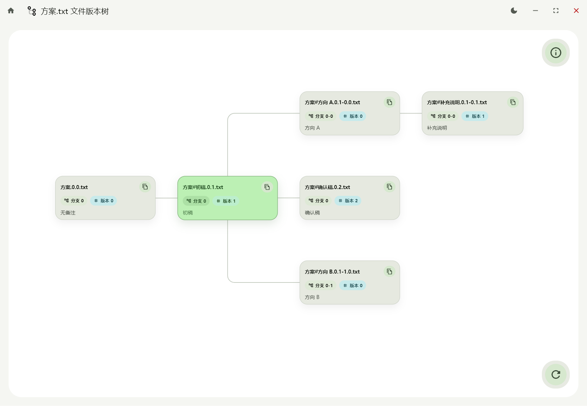

# Vertree

**Keep every iteration traceable.**

Vertree is a desktop version manager for individual files. Keep milestones as ordinary file copies, inspect their lineage in a version tree, and use automatic snapshots, read-only previews or temporary LAN sharing when needed. Continue editing in the applications you already use.

[中文](README.md) · [Website](https://vertree.w0fv1.dev/) · [Quick start](docs/docs/tutorial-usage/quick-start.md) · [Stable downloads](https://github.com/w0fv1/VerTree/releases/latest) · [Troubleshooting](docs/docs/tutorial-usage/troubleshooting.md)



## Choose the right kind of history

Manual versions live beside the source file, with version numbers and optional notes in their names. Automatic snapshots live under `.vertree/snapshots/<task UUID>` and use ownership manifests. The default minimum snapshot interval is five minutes, with fifty recognized snapshots retained per task; not every save produces a separate snapshot.

Previews are read-only and processed locally. LAN sharing is a separate, explicit action: a temporary link lets network-reachable recipients download from the sending computer. The authenticated loopback API is disabled by default.

Full copies consume disk space. Local history is not a substitute for an independent backup, and format support does not imply exact layout reproduction or general binary merging.

## Release status

**V3.0.0** adds Windows fast permanent deletion and File Locksmith-style usage inspection, per-action settings for both Explorer menu styles, single-file preferences and a revised homepage, website and documentation. Deletion requires confirmation and may terminate eligible blocking applications. Usage inspection is a separate, non-deleting feature. See the [release notes](https://github.com/w0fv1/VerTree/releases/tag/V3.0.0).

Deletion and file-usage inspection are separate pages, reached through file context menus. Confirming deletion also authorizes removal of read-only attributes and termination of eligible blocking processes; unsaved work may be lost. System protections are not bypassed. See the [deletion guide](docs/docs/tutorial-usage/fast-delete.md) and [file-usage guide](docs/docs/tutorial-usage/file-locks.md).

Upgrades from before 2.0 require monitoring to be configured again. Current preferences use `settings.json` and UUID-based `monitorTasks`; legacy `config.json` and `*_bak` snapshots are not imported. The development branch no longer creates or restores `.previous` preferences. Old backup contents are not deleted as part of preference cleanup.

## Install and try one file

On Windows x64, choose the EXE installer. On macOS, match the architecture supplied by the release; the 3.0.0 release supplies arm64 builds. On Linux x64, choose DEB, RPM or the complete portable archive. Keep all bundled DLLs and data files when using portable distributions.

Windows previews require WebView2 Runtime; macOS uses WKWebView; Linux opens a local browser. End users do not need Flutter, Node.js, Python or the standalone Office-Viewer application. See [platform and installation details](docs/docs/tutorial-usage/install.md).

Save a disposable example document, create a manual backup with a note, and open its version tree. Verify the new copy before enabling monitoring for important work.

## Build and test

Use Flutter stable with the Dart constraint in `pubspec.yaml`, Python 3, Node.js 24 and the target platform's desktop toolchain. Windows also requires Visual Studio C++ tools, Windows SDK and NuGet. Build the pinned preview frontend before the first Flutter run:

```bash
git clone https://github.com/w0fv1/VerTree.git
cd VerTree
git submodule update --init vendor/office-viewer
python tools/build_office_preview.py
flutter pub get
flutter run -d windows
```

Use `macos` or `linux` on the corresponding host. Vertree imports Office-Viewer's React preview modules, not its Tauri runtime.

```bash
dart run tools/check_architecture.dart
flutter analyze
flutter test
npm --prefix docs ci
npm --prefix docs run build
npm --prefix docs run audit:static
```

The [build guide](docs/docs/tutorial-develop/develop.md), [architecture rules](docs/architecture-evolution.md), [API guide](docs/docs/tutorial-develop/local-api.md) and [site maintenance guide](docs/README.md) describe the supported workflows. Destructive tests must use dedicated temporary fixtures and test-owned processes only.

## License

MIT; see [LICENSE](LICENSE). Bundled third-party components retain their own notices. No cloud synchronization or multi-user merge service is included.
