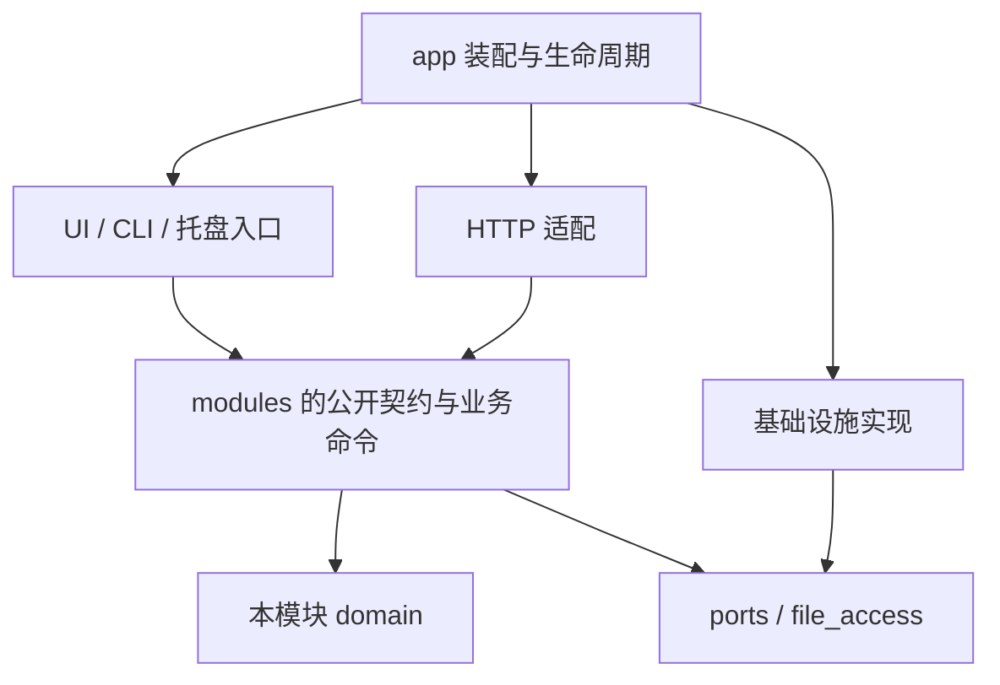

# Vertree 长期演进架构

日期：2026-09-07。状态：已落地的架构与后续演进约束。

## 决策

采用按业务模块组织的单体应用，通过构造注入装配依赖。继续使用一个 Dart package；只有独立发布、团队边界或真实复用需求出现时才拆 package。本次是破坏性重构：不保留旧服务门面、旧导出路径、双实现、配置迁移或旧 API 路由别名。

手动版本仍是普通文件，版本关系可从文件名重建；自动快照有独立身份与保留策略。UI、CLI、托盘、HTTP 的交互流程可以不同，但文件变更必须调用同一业务命令。

## 已落地目录与职责

| 位置 | 唯一职责 |
| --- | --- |
| `lib/main.dart` | 调用桌面启动入口 |
| `lib/app/composition_root.dart` | 装配文件访问、版本、快照与监控依赖 |
| `lib/app/desktop_app.dart` | 桌面启动、平台装配、导航与窗口交互 |
| `lib/app/app_host.dart` | 有序启动、部分启动失败回收、逆序关闭 |
| `lib/foundation` | 错误、结果、时钟和进程内事件 |
| `lib/file_access` | 文件访问契约、共享写入协调器、本机提交实现 |
| `lib/modules/versions` | 命名规则、版本号、版本图、创建、改标签、恢复和比较 |
| `lib/modules/snapshots` | 快照提交、归属验证、查询、保留与清理 |
| `lib/modules/monitoring` | 任务定义、期望状态、监听状态与调度 |
| `lib/modules/settings` | 设置默认值与校验 |
| `lib/modules/automation` | 有界作业调度与取消 |
| `lib/modules/preview` | 预览活动状态 |
| `lib/adapters/ui` | 桌面依赖注入、主题、版本操作反馈和版本图布局模型 |
| `lib/api`、`lib/service/local_http_api_service.dart` | HTTP 路由、协议、DTO、界面自动化适配 |
| `lib/component/configer.dart` | 文件式设置持久化适配 |
| `lib/service` 中预览和分享服务 | 图片渲染、预览内容传输和 LAN 分享等外部能力 |



业务模块不能导入桌面入口、UI、HTTP、component 或 service。domain/application/ports 禁止 Flutter、dart:io 和基础设施实现。模块之间只引用公开文件，如 `modules/versions/versions.dart`，不导入对方内部文件。只有 app 可以选择并装配基础设施实现。foundation 不反向依赖业务。

`tools/check_architecture.dart` 通过 Dart AST 检查 import、export、part 和条件导入；检查跨模块内部引用、禁止的依赖与循环。没有历史白名单。CI 在拉取请求和 main 推送上执行依赖检查、分析和测试。

## 核心不变量

### 版本

- `VersionName` 和 `FileVersion` 只处理值与规则，不读取文件、不修改文件。
- `VersionCatalog` 负责扫描同族版本，输出不可变的 `VersionGraph`。重复版本与缺失父节点产生 diagnostics，API 保留全部 entries，不静默丢弃异常文件。
- UI 的 `FileNode` 属于显示模型，分支布局从关系推导；不得再承担复制、改名和恢复。
- `VersionCommands` 是创建、分支、改标签、恢复的写入口。标签校验、冲突检查、成功事件集中执行。
- 恢复前为已有目标创建 `before-restore` 版本；检测到目标变化则拒绝覆盖。

### 写入

生产实例共享一个 `FileMutationCoordinator`。手动版本与自动快照按规范化源目录协调；快照还按任务 UUID 协调。多资源一次获取、顺序固定，锁内不递归获取锁。关闭时拒绝新操作并等待已接收操作完成。

新文件先在同目录暂存，复制前后比较源元数据并 flush，之后以不覆盖目标的方式发布。Windows 使用 MoveFileExW 的不替换模式；POSIX 使用 link/unlink，文件系统不支持时明确失败。源检查、内部锁和不覆盖发布不能提供对外部编辑器的完整事务隔离。

已有目标恢复使用暂存文件与预期元数据检查。当前没有持久事务日志、跨进程锁或启动恢复作业；进程崩溃可能留下暂存文件或无清单的快照内容。未知文件保留，不进行猜测性删除。需要进一步提高断电恢复能力时，在 file_access 实现日志和故障注入测试，不能让各业务模块各写一套恢复逻辑。

### 快照

路径：`<源目录>/.vertree/snapshots/<任务 UUID>/<快照 UUID>.<扩展名>`，同名 JSON 清单是提交标记，包含 schemaVersion、任务与快照 ID、源路径、文件名、时间和大小。

只有完整且归属验证通过的清单记录参与查询、保留与删除。成功提交之后才执行保留策略；清理失败发出独立事件，不把成功快照伪装成失败。保留最少一份。旧 `_bak` 目录、未知文件和损坏记录既不读取，也不自动删除。

### 监控

构造函数不启动监听。`AppHost` 显式启动监控，关闭时取消监听和计时器并等待正在进行的复制。

`enabled` 是用户期望状态，`runtimeStatus` 是实际运行状态，不能互相代替。任务有持久 UUID；移除任务保留其归档身份及快照，重新添加同一路径复用归档身份。

文件事件先合并；最小间隔从上次成功快照计算。复制期间再次变脏会安排后续复制。失败不推进成功时间，不触发保留删除，保留 dirty 并重试。时钟、监听器和快照命令均可注入，测试不靠真实睡眠猜测调度结果。

任务列表由 manager 持有，对外只读，并发布 revision 变化。监控页面订阅变化，HTTP 创建或变更任务后不需要重新进入页面才能同步。

### 设置、事件与退出

`Configer.get` 不写配置；默认值集中于 AppSettings。写入队列保存独立快照，暂存写入并替换，保留前一份有效文件。损坏配置另存 `.corrupt-*`，可读取 `.previous`。业务需确认落盘时 await flush；当前同步 set 会先更新内存，不承诺整个设置集合的事务回滚。

事件总线由 app 创建并注入，包含启动 sessionId、单调序号与 schemaVersion。SSE 游标为 `sessionId:序号`；过期或上次进程的游标要求重新查询状态。手动版本与自动快照分别发布 version.created 和 snapshot.created。事件是通知，不替代命令或数据库。

AppHost 在依赖就绪后开放 HTTP；停止时先停入口，再关预览、分享、监控和作业，排空文件写入，最后关闭主题、设置与事件。单项关闭异常会记录并继续回收其余资源。

## 不兼容变更

- 配置文件改为 `settings.json`，要求 `_schemaVersion: 1`，监控列表为 `monitorTasks`，任务要求 UUID 与 `enabled`。不读取或转换旧 config.json / monitFiles。
- 自动快照只认 UUID 目录和清单；旧备份文件不删除，但不出现在新快照查询中。
- 手动版本创建和查询统一为 `POST/GET /api/v1/versions`。
- 自动快照查询为 `GET /api/v1/snapshots?path=...` 和 `GET /api/v1/monitor-tasks/{id}/snapshots`。
- 旧 `/backups`、`/version-files` 和任务 `/backups` 路由不注册。
- `/version-trees` 返回 `entries`、`parents`、`diagnostics`；HTTP 不再序列化 UI 布局树。
- JSON 成功体为 `{success: true, code: "OK", data: ...}`，失败体为 `{success: false, code, message}`。JSON 上限 1 MiB，两组路由共用解析和错误映射。
- 删除 app_runtime、core 下旧监控/结果/版本树入口和 VersionOperations 门面；所有调用者直接更新，没有转发文件。

## 后续扩展规则

1. 新能力先说明归属模块、输入输出、失败语义与持有状态，不先新增一个含混的 Manager/Service。
2. 新入口调用已有命令；发现规则不适用时修改模块契约和测试，禁止复制算法。
3. 需要插件、网络或文件系统时，在 ports 声明需求，在 infrastructure 实现，由 app 注入。
4. 模块依赖增加时必须同时说明方向与理由，并更新检查器；禁止用公开导出绕开内部层次。
5. sharing 和预览渲染/传输仍是独立服务适配器。只有出现第二个实现、复杂业务状态或复用需求时再提取对应领域和端口，不能为目录整齐制造空抽象。
6. 本次保留单包组织，但检查器是 CI 约束而非 Dart 编译器的物理隔离；若团队增长导致频繁绕过规则，再拆 package。

## 验证

```sh
dart run tools/check_architecture.dart
flutter analyze
flutter test
flutter build windows --debug
```

回归测试覆盖并发版本分配、改名后继续备份、同名冲突不覆盖、写锁失败与排空、所有权清理、失败重试和尾部事件、任务状态持久化、配置损坏、启动回收、SSE 以及真实 HTTP 到文件系统的版本/监控/快照链路。

Windows 已构建验证。macOS/Linux 的原生发布路径仍需在对应平台执行同一测试集；不能把 Windows 结果当作所有平台的验证结论。
